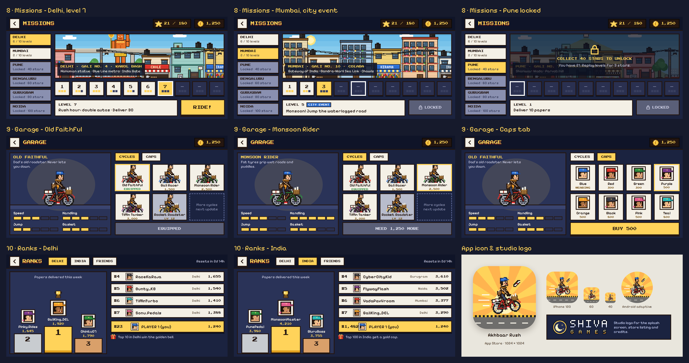

# Akhbaar Rush

A 16-bit mobile browser game by **Shiva Games**. Ride your cycle through the galis of Delhi, Mumbai, Pune,
Bengaluru, Gurugram and Noida, dodge cows, autos and potholes, and deliver every newspaper before the finish flag.



- Plays in the phone browser, turned sideways. Installs to the home screen like an app.
- 6 cities × 10 levels, garage upgrades, daily bonus, weekly leaderboard, English and हिंदी.
- Plain HTML, CSS and JavaScript. No build step: edit, push, done.

## Play it on your computer

You need [Node.js](https://nodejs.org) 18 or newer.

```bash
npm run dev
```

Open the address it prints. To try it on your phone, connect the phone to the same Wi-Fi and open the
"Your phone" address, then turn the phone sideways. On a computer use the arrow keys and Space.

## Put it online (free) and share it

Pick one host. Each one redeploys automatically every time you push to GitHub.

**Option A — Cloudflare Pages (recommended, fast in India)**
1. Push this folder to a new GitHub repository.
2. In Cloudflare → Workers & Pages → Create → Pages → Connect to Git, choose the repo.
3. Framework preset: **None**. Build command: *(empty)*. Output directory: `/`. Deploy.
4. You get a link like `akhbaar-rush.pages.dev` — send it to your friends.

**Option B — Netlify:** New site → Import from Git → pick the repo → leave build command empty, publish directory `.`.

**Option C — GitHub Pages:** repo Settings → Pages → Source: **GitHub Actions**. The included
`.github/workflows/pages.yml` publishes every push to `main` to `https://<you>.github.io/<repo>/`.

## Turn on the online leaderboard (optional, free)

Without this the game works fully, but Ranks only shows your own score.

1. Create a project at [supabase.com](https://supabase.com).
2. SQL Editor → New query → paste everything from `supabase/schema.sql` → Run.
3. Project Settings → API → copy the **Project URL** and the **anon public** key into `src/config.js`.
4. Push. Scores now appear for everyone, by city and all of India, reset every Monday.

The anon key is safe to publish; the database only lets it read the leaderboard and update your own row.
Never put the *service_role* key in this project.

## Push an update

1. Make your change (or ask Claude Code to).
2. Run `npm test` to check nothing broke.
3. In `sw.js` bump `VERSION` (e.g. `akhbaar-rush-v1.0.1`) and update the version label on the title screen.
4. `git commit` and `git push`. Players get a "New version ready – tap to update" message.

## Working with Claude Code

Open this folder and run `claude`. `CLAUDE.md` explains the code layout, the pixel coordinate system,
how to add cities, cycles, obstacles and music, and the release checklist. `docs/GAME_DESIGN.md` has the rules and balance.

Example requests:
- "Make level 1 easier: fewer cows and a slower start."
- "Add a Kolkata city with a Howrah Bridge backdrop."
- "Add a magnet power-up that pulls coins for 5 seconds."

## Folder guide

```
index.html            all screens (markup)
style.css             UI styles
src/                  game code (main.js engine + screens, data, audio, leaderboard, pwa, config)
assets/               sprites and city backdrops
icons/                app icons for the home screen
manifest.webmanifest  install settings (landscape, full screen)
sw.js                 offline support and update prompts
supabase/schema.sql   leaderboard database
tests/smoke.mjs       automated play-through
tools/serve.mjs       local server
tools/art/            scripts that generated all the pixel art
docs/                 game design, screen designs, sprite sheets, logos, store icons
```

## Tests

```bash
npm install
npx playwright install chromium   # first time only
npm test
```

The test plays the game on a computer screen and then, with touch taps only, as an iPhone and as an Android phone.

## Credits

Game, art and music © Shiva Games. Fonts: Press Start 2P, Pixelify Sans and Hind (Google Fonts, SIL Open Font License).
